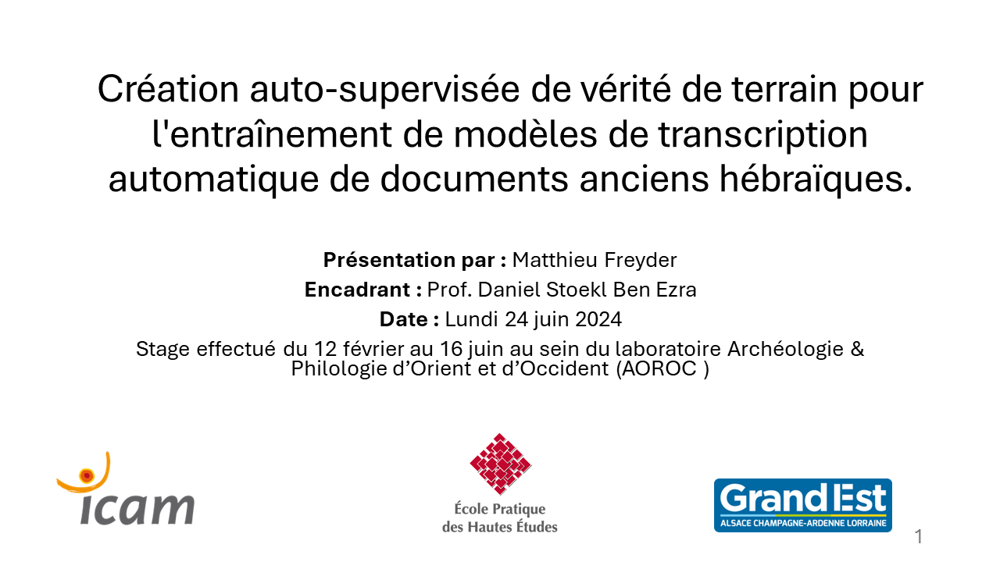

# Soutenance de Stage
**Présentation par** : Matthieu Freyder
**Encadrant** : Prof. Daniel Stoekl Ben Ezra
**Date** : Lundi 24 juin 2024
Stage effectué du 12 février au 16 juin au sein du laboratoire Archéologie &
Philologie d’Orient et d’Occident (AOROC )

## Création auto-supervisée de vérité de terrain pour l'entraînement de modèles de transcription automatique de documents anciens hébraïques.
Création auto-supervisée de vérité de terrain pour l'entraînement de modèles de transcription automatique de documents anciens hébraïques.


## Introduction

Selon une étude du Pew Research Center, internet perd la mémoire.
38 % des pages web qui existaient en 2013 ne sont plus accessibles dix ans plus tard.


Internet ne serait donc pas la mémoire collective que l'on croyait.
Mais si internet perd la mémoire, cette mémoire ne demeure pas moins vive. C'est une source de données accessible et exploitable.


Le livre, quant à lui, est un support de mémoire plus pérenne. Néanmoins, ce contenu physique est moins facilement accessible et exploitable à grande échelle. Combien de livres dorment dans les bibliothèques sans que leur contenu puisse être exploité faute de numérisation ? Combien de scans de livres restent inutilisés sur les serveurs des bibliothèques faute de transcription ?

La transcription des documents anciens est un enjeu majeur pour réactiver cette mémoire de l'humanité. Si ces documents anciens, dont certains n'ont pas été ouverts depuis des siècles devenaient accessibles, nous assisterions à de véritables avancées dans la connaissance de notre humanité.
Imaginez:
- accès universel, moteurs de recherche, analyse de texte, comparaison de texte, traduction automatique, etc.
- meilleurs connaissance de l'histoire des manuscrits et des auteurs
- découvertes (ou redécouvertes d'informations inédites)
- utilisation du big data pour des analyses statistiques et des corrélations inédites
- etc.

L'EPHE, notamment au travers du projet MiDRASH poursuit cet objectif en développant des outils pour la transcription automatique de documents anciens.

Liens vers les sources:
https://web.developpez.com/actu/358702/Disparition-d-Internet-un-regard-sur-la-memoire-numerique-en-peril-de-la-Chine-a-la-France-une-degradation-inquietante-des-archives-numeriques/
https://web.developpez.com/actu/358082/Quand-le-contenu-en-ligne-disparait-38-pourcent-des-pages-web-qui-existaient-en-2013-ne-sont-plus-accessibles-dix-ans-plus-tard-et-54-pourcent-des-pages-Wikipedia-contiennent-au-moins-un-lien-brise/

## Le projet MiDRASH
MiDRASH – Migrations of Textual and Scribal Traditions via Large-Scale Computational Analysis of Medieval Manuscripts in Hebrew Script (Migrations des traditions textuelles et scribales via l'analyse computationnelle à grande échelle des manuscrits médiévaux en écriture hébraïque)


**Projet** : Projet de six ans en sciences humaines computationnelles sur les manuscrits hébraïques médiévaux.
**Financement** : Subvention ERC Synergy de plus de 10 millions d'euros accordée par le Conseil européen de la recherche.
**Institutions** : EPHE et ses partenaires en Israël (Université de Tel-Aviv, Bar Ilan, Bibliothèque nationale d'Israël, Université de Haïfa).
Technologies clés : eScriptorium et Kraken.
### Objectifs du projet
**Conversion des manuscrits**: Convertir les images de nombreux manuscrits en texte interrogeable (y compris les insertions interlinéaires et les commentaires marginaux). Cela nécessite des améliorations significatives dans la segmentation de page informatisée et la reconnaissance de l'écriture manuscrite.

**Analyse intertextuelle** : Comparer les textes pour identifier citations, paraphrases, emprunts, allusions et autres relations intertextuelles, et les rendre disponibles pour l'étude.

**Analyse paléographique** : Former des algorithmes pour analyser l'écriture manuscrite afin de déterminer où et quand chaque manuscrit a été écrit, jusqu'au siècle et dans quel pays. Ceci implique une collaboration entre paléographes humains et apprentissage machine.

**Analyse linguistique** : Former des algorithmes pour analyser les caractéristiques linguistiques des textes (lexicales, morphologiques et syntaxiques) afin d'aider à la recherche textuelle et de situer les œuvres littéraires dans leur contexte historique.

**Études de cas** : Utiliser les ressources pour cartographier la migration et l'évolution des textes et des idées au sein des communautés juives médiévales.

**Accessibilité** : Données et algorithmes open source.
**Chercheurs principaux**
Nachum Dershowitz (Université de Tel-Aviv)
Judith Olszowy-Schlanger (EPHE-PSL)
Avi Shmidman (Université Bar Ilan)
Daniel Stökl Ben Ezra (EPHE-PSL)

source: https://escripta.hypotheses.org/500
## Notre mission
Comment mon stage s'inscrit-il dans le projet MiDRASH ?
Le projet MiDRASH a besoin de transcrire des manuscrits hébraïques médiévaux en texte interrogeable. Il s'appuie pour cela sur des outils existants (eScriptorium et Kraken), qui nécessitent l'utilisation de modèles de transcription adaptés aux divers manuscrits et imprimés à traiter.

Pour entraîner un modèle de transcription, il est nécessaire de disposer d'un corpus de données annotées. L'annotation manuelle de ces données est une tâche longue, fastidieuse et coûteuse. En effet, il faut transcrire pour chaque manuscrit, un nombre conséquent de lignes de texte.

Ma mission consiste à développer un outil d'annotation auto-supervisée, afin de créer automatiquement des corpus de données annotées pour l'entraînement des modèles de transcription.

## Principe de l'annotation auto-supervisée
Comment procéder ?
Pour réaliser l'annotation auto-supervisée, nous avons la chance d'avoir à notre disposition un grand nombres d'écrits en caractères hébraïques sous forme numérique.


L'idée est d'effectuer une première transcription automatique des manuscrits à l'aide de modèles 'basiques' et 'génériques'.

On peut ensuite rechercher dans ces transcriptions, des correspondances avec des textes numériques existants. Peut-être que le texte du manuscrit correspond à un texte déjà connu (vérité de terrain), ou qu'il le cite simplement.

On peut alors mettre en correspondance les lignes de texte du manuscrit avec les lignes de texte du texte numérique existant qui matchent, et utiliser ces données pour améliorer les modèles de transcription.

## Les outils: eScriptorium
eScriptorium : Une plateforme open source pour l'analyse de documents historiques.


### le projet

eScriptorium est développé dans le cadre du programme Scripta PSL de l'Université PSL, une fondation récente regroupant des institutions prestigieuses telles que: l'ENS, l'EPHE, l'Ecole Nationale des Chartes, et comme membres associés l'EHESS (École des hautes études en sciences sociales), l'EFEO (École Française D'extrême-Orient, le Collège de France ainsi que l'IRHT (Institut de recherche et d'histoire des textes - CNRS).

Le programme Scripta rassemble environ une centaine de chercheurs en sciences humaines, sociales, numériques et en informatique.

Les chercheurs étudient des documents écrits de diverses régions, cultures, écritures et langues couvrant 5500 ans, avec un accent sur l'époque prémoderne.

L'objectif d'eScriptorium est de combiner des outils informatiques avec des outils numériques manuels pour la transcription et l'annotation approfondie de textes et d'images (paléographiques, philologiques, historiques et linguistiques).

Les principaux utilisateurs ciblés incluent les chercheurs en sciences humaines, les informaticiens, les bibliothécaires et les archivistes, les étudiants, ainsi que le grand public.

Le développement de la plateforme a commencé en novembre 2018, bien que Kraken, l'un de ses composants principaux, soit en développement depuis 2017.

### les fonctionnalités
Les utilisateurs interagissent avec la plateforme via une interface web graphique écrite en Django et Javascript.
Aucun téléchargement d'applet n'est nécessaire, l'interface est optimisée pour Chrome et Firefox.
La plateforme gère :
1. la gestion des projets et des utilisateurs
2. La création de documents et de leurs métadonnées
3. Importation d'images, de métadonnées et de textes
4. Exportation de la segmentation et du texte
5. Interaction manuelle via le zoom, le choix des panneaux d'affichage (image source, segmentation, transcription), la création de régions et de lignes ou la transcription manuelle, l'édition de métadonnées.
6. Traitement informatique des images:
- segmentation: application d'un modèle de segmentation de page pour détecter les lignes de texte et les régions.
- transcription: application d'un modèle de transcription pour obtenir un texte brut.
- alignement: recherche de correspondances entre la transcription et des textes numériques existants, à des fins de comparaisons, et d'entraînement de modèles de transcription.
7. Entraînement de modèles de segmentation et de transcription.

## Les outils: Kraken
Kraken est le moteur d'HTR/OCR utilisé par eScriptorium, optimisé pour les documents historiques et les scripts non latins. Il est développé par Benjamin Kiessling, ingénieur de recherche à l'EPHE.


#### Segmentation

*source: https://kraken.re/main/*


*source: https://kraken.re/main/api.html*
#### Transcription

*source: https://kraken.re/main/api.html*

La reconnaissance est un processus en plusieurs étapes:
- un réseau neuronal produit une matrice avec une valeur de confiance pour les sorties possibles à chaque étape.
- cette matrice est décodée en une séquence d'étiquettes entières (domaine des étiquettes) qui sont ensuite converties en points de code Unicode à l'aide d'un codec.


B. Kiessling, Avancées en Reconnaissance Optique des Caractères pour les Documents Arabes Historiques, phdthesis, Université Paris sciences et lettres, [s.l.], 13 avril 2021. URL : https://theses.hal.science/tel-03854403.. Consulté le 16 mai 2023.
B. Kiessling, D.S.B. Ezra et M.T. Miller, BADAM: A Public Dataset for Baseline Detection in Arabic-script Manuscripts, 9 juillet 2019. URL : http://arxiv.org/abs/1907.04041.. Consulté le 2 juin 2023.
B. Kiessling, « A Modular Region and Text Line Layout Analysis System », dans 2020 17th International Conference on Frontiers in Handwriting Recognition (ICFHR), présenté à 2020 17th International Conference on Frontiers in Handwriting Recognition (ICFHR), Dortmund, Germany, IEEE, septembre 2020. URL : https://ieeexplore.ieee.org/document/9257770/.. Consulté le 19 juin 2024.
« API Quickstart — kraken documentation », [s.d.]. URL : https://kraken.re/main/api.html.. Consulté le 19 juin 2024.


## Slide 8. Les outils: Passim

Passim est un outil open source (java, python, apache spark) de détection automatique de réutilisation de texte, implémentant des algorithmes pour détecter et aligner des passages similaires de textes.


Passim a été développé par David Smith de l'Université Northeastern (US), pour étudier la viralité des textes dans les journaux du XIXe siècle.
Utilisations de Passim :
- Détection des rééditions multiples d'un même ouvrage dans une bibliothèque numérique.
- Identification de citations dans un texte avec des œuvres cibles connues (ex. : citations de la Bible dans la littérature anglaise du 17e siècle).
- Étude de la viralité et de la propagation des textes (ex. : textes viraux dans les journaux historiques).
- Filtrage des documents dupliqués dans une collection avant des étapes de traitement supplémentaires (ex. : modélisation de sujets/topic modelling).

### Fonctionnement

Dans un premier temps, les textes sont comparés en les balayant par fenêtre de caractères (tuilage de n-grammes / w-shingling), puis les alignements sont raffinés grâce à l'algorithme de Smith-Waterman. Cet algorithme parcourt chaque document caractère par caractère et détermine si chaque caractère d'un document correspond à un caractère de l'autre. Des espaces sont insérés là où les caractères ne correspondent pas. Ci-dessous un exemple d'alignement obtenu par Passim. Ces resultats se présentent sous forme de fichiers json.


*Exemple d'alignement obtenu par Passim*

D.A. Smith, R. Cordell et E.M. Dillon, « Infectious texts: Modeling text reuse in nineteenth-century newspapers », dans 2013 IEEE International Conference on Big Data, présenté à 2013 IEEE International Conference on Big Data, Silicon Valley, CA, USA, IEEE, octobre 2013. URL : http://ieeexplore.ieee.org/document/6691675/.. Consulté le 15 juin 2023.
D.A. Smith, R. Cordell et A. Mullen, « Computational Methods for Uncovering Reprinted Texts in Antebellum Newspapers », American Literary History, vol. 27, nᵒ 3 (septembre 2015).
M. Romanello et S. Hengchen, « Détecter la réutilisation de texte avec Passim », Programming Historian (mai 2021). URL : https://programminghistorian.org/fr/lecons/detecter-la-reutilisation-de-texte-avec-passim.. Consulté le 15 février 2024.
« Tutorial for Passim, originally written by Matteo Romanello and Simon Hengchen, updated by David Smith to cover the installation and use of Passim version 2 », GitHub, [s.d.]. URL : https://github.com/dasmiq/ph-submissions/blob/passim2-replace/en/published/originals/detecting-text-reuse-with-passim.md.. Consulté le 20 juin 2024.


# Slide 9. Principe de fonctionnement du pipeleine TABA


1. Une page de document est traitée par Kraken (segmentation et transcription), à l'aide d'un modèle générique. eScriptorium permet de faire cette opération via son interface utilisateur.
2. Le resultat de la transcription est comparé avec un corpus de textes numériques existants, à l'aide de Passim.
3. Les correspondances entre les lignes de texte du document et les lignes de texte du corpus sont utilisées pour entrainer un modèle de transcription adapté au document.

Ce principe doit être appliqué à un grand nombre de documents, dans lesquels rechercher un grand nombre d'alignement avec des textes numériques existants.

L'équipe a nommé ce pipeline TABA (There And Back Again), en référence au mouvement d'aller retour entre eScriptorium et Passim, et en hommage au Hobbit de J.R.R. Tolkien.


# Slide 10. Collecter les textes numériques existants (GT)
Afin de pouvoir comparer les transcriptions des documents avec des textes numériques existants et rechercher des alignements, il est nécessaire de disposer d'un corpus de textes numériques. Ces textes numériques constituent la vérité de terrain (abrégé GT pour Ground Truth) pour le pipeline TABA.
Le site Sefaria (https://www.sefaria.org/) est une source de textes numériques en hébreu. Une API permet de récupérer des textes en hébreu et en anglais. Documentation: https://developers.sefaria.org/

Les textes sont disponibles sous forme de fichiers JSON, contenant le texte segmenté en chapitres, versets, etc. et des métadonnées associées (titre, catégorie, nom des sections, etc.)

Notre obtectif est de parcourir ces fichiers pour:
- extraire le texte et le concaténer en une seule chaîne de caractères, qui sera enregistrée dans un fichier texte.
- créer pour chaque fichier texte un index qui permettra, connaissant la position d'un caractère dans la chaîne de caractère, de remonter à sa référence (chapitre, verset, etc.). Cela sera utile pour identifier les alignements entre les documents et les textes numériques.

Sefaria organise ses données JSON de la manière suivante :

- **Structure simple** : Pour les textes simples, Sefaria utilise une JaggedArray, qui est un tableau imbriqué représentant le contenu textuel réel. Par exemple, un livre de la Bible pourrait être représenté comme un tableau de chapitres, chaque chapitre étant un tableau de versets.
- **Structure complexe** : Pour des textes plus complexes ou des collections de textes, Sefaria utilise une structure d'arbre avec différents types de nœuds.
- **JaggedArray** : C'est une structure de données qui contient le texte réel. C'est un tableau imbriqué d'une certaine profondeur, où le niveau le plus bas est un tableau de chaînes de caractères.
```python
[
  ["Text of 1:1", "Text of 1:2", ], # Chapter 1
  ["Text of 2:1", "Text of 2:2", "Text of 2:3", "Text of 2:4", "Text of 2:5"], # Chapter 2
  ["Text of 3:1", "Text of 3:2", "Text of 3:3"], # Chapter 3
  ["Text of 4:1", "Text of 4:2", "Text of 4:3", "Text of 4:4"] # Chapter 4
]
```
- **JaggedArrayNode** : C'est un élément du schéma d'un index qui décrit la structure que la JaggedArray devrait avoir, sans contenir le texte lui-même. Il spécifie des informations comme la profondeur du texte, les types d'adresse (par exemple, chapitre et verset), et les noms des sections.
```json
 "schema" : {
        "nodes" : [
            {
                "nodeType" : "JaggedArrayNode",
                "depth" : NumberInt(1),
                "addressTypes" : ["Integer"],
                "sectionNames" : ["Paragraph"],
                "titles": [...],
                "key" : "Introduction"
            },
            {
                "nodeType" : "JaggedArrayNode",
                "depth" : NumberInt(3),
                "addressTypes" : ["Perek","Pasuk","Integer"],
                "sectionNames" : ["Chapter","Verse","Comment"],
                "default" : true,
                "key" : "default"
            },
            {
                "nodeType" : "JaggedArrayNode",
                "depth" : NumberInt(1),
                "addressTypes" : ["Integer"],
                "sectionNames" : ["Paragraph"],
                "titles": [...],
                "key" : "Conclusion"
            }
        ],
        "nodeType" : "SchemaNode",
        "titles" : [...],
        "key" : "Example Text"
    }
```
Example de structure de texte complexe:

Le schéma d'Abarbanel sur la Torah. source: https://developers.sefaria.org/docs/the-schema-of-a-complex-text

Cette organisation permet à Sefaria de gérer efficacement à la fois la structure (via JaggedArrayNode) et le contenu (via JaggedArray) des textes, offrant une grande flexibilité dans la gestion et l'affichage des textes de complexité variable.

Le code que nous avons développé, ainsi que les fichiers de données générés, sont disponibles sur GitHub:
[github](https://github.com/Freymat/from_Sefaria_to_Passim)

## Exemple de résultats d'alignement

Il est possible de visualiser les résultats dans eScriptorium.
On peut naviguer entre les images et les transcriptions, et comparer les transcriptions


Chaque ligne est une transcription différente.
Les couleurs marquent les différences entre les transcriptions:
- la ligne sans coloration est la transcription de référence/éditable
- les caractères verts ne sont pas présents dans la transcription courante (éditable)
- les caractères rouges ne sont pas présents dans la transcription comparée. 
On remarque que le modèle de base (kraken:sinai_no_voc_61) lit כמותו, alors que la transcription correcte est כמוהו (le modèle de base a lu un ת à la place d'un ה).

Pratique vous la visualisation, mais pour traiter statistiquement les résultats, ou si le nombre de documents est très grand, il faut s'appuyer sur d'autres outils.

## Diagramme de flux de TABA
Voici un diagramme de flux du pipeline TABA, pipeline de transcription automatique basé sur l'alignement entre les transcriptions OCR et des textes numériques existants. Son objectif est de produire de grandes quantités de vérité de terrain pour l'entraînement de modèles OCR.


Le Pipeline est développé en python. Il est composé de plusieurs modules:
- Import des documents depuis eScriptorium. Les documents sont préalablement segmentés et transcrits par Kraken. Il est possible de lancer le pipeline dans connexion avec eScriptorium. Cela permet de travailler sur de très grands lots d'images.
- Préparation des données pour Passim. Les données sont préparées pour être traitées par Passim.
- Calcul des alignements avec Passim. Les alignements sont calculés entre les documents et les textes numériques existants (GT).
- Création des fichiers XML de transcription. Les alignements retenus (ratio de Levenshtein > seuil) remplacent les transcriptions brutes des documents. Les lignes sans alignement sont laissées vides.
- Les transcriptions peuvent être exportées vers eScriptorium, si le nombre d'images et de GT textes est raisonnable. De nouveaux modèles de transcription peuvent être entraînés à partir de ces données.
- Compilation des résultats. Les résultats sont compilés dans des fichiers tsv, facilement exploitables avec polars ou un tableur.

```
TABA: automatic transcription pipeline based on alignment between OCR transcriptions and existing digital texts, using Passim. Its aim is to produce
large quantities of ground truth for training OCR models with eScriptorium and Kraken.

optional arguments:
  -h, --help            show this help message and exit
  --import_document_from_eSc
                        Import document from eScriptorium
  --prepare_data_for_passim
                        Prepare data for Passim
  --compute_alignments_with_passim
                        Compute alignments with Passim
  --create_xmls_from_passim_results
                        Process Passim's alignment results
  --compiling_results_summary
                        Summarize results in tsv files
  --export_xmls_to_eSc  Export results to eScriptorium
  --run_all             Run all steps
  --no_import           Skip the xml from eScriptorium import step
  --no_export           Skip the xml export to eScriptorium step
  --clean_all           Clean the pipeline from zero
  --clean_except_xmls   Clean the pipeline, except the XMLs from eScriptorium
  --clean_except_passim
                        Clean the pipeline, except the Passim results
  --backup_results      Backup the pipeline results
```


## Sortie du Pipeline TABA

Un registre des alignements (alignment_register.json) recense les données des alignements pour chaque image et chaque texte numérique (GT).

Voici comment les données d'alignement de ce manuscrit sont stockées dans le registre des alignements:


```json
{
        "filename": "IE87581919_00018.xml",
        "part_pk": 734771,
        "part_title": "Element 37",
        "levenshtein_threshold": 0.8,
        "total_aligned_lines_count": 10,
        "aligned_clusters_size": [
            4,
            1,
            1,
            1,
            3
        ],
        "GT_id": "Machzor_Yom_Kippur_Ashkenaz_clean_concatenated.txt"
    }
```


On y lit:
- les informations sur le document (filename, part_pk, part_title)
- le nom du texte numérique aligné (GT_id)
- le seuil de Levenshtein utilisé pour l'alignement (levenshtein_threshold)
- le nombre total de lignes alignées (total_aligned_lines_count)
- la taille groupes de lignes successivement d'alignées(aligned_clusters_size)

Ces indicateurs permettent d'identifier rapidement les documents où de la vérité de terrain de qualité est trouvée.

# Utilisation de Polars pour l'analyse des résultats
Nous avons utilisé la bibliothèque Polars pour créer efficacement des dataframes à partir des données d'alignement.

5 tableaux de données sont créés par le pipeline:
- 2 tableaux donnent respectivement pour chaque document (où se trouve au moins un alignement) 1) le nombre total de lignes alignées pour chaque GT, et 2) la taille du plus gros groupe d'alignements successifs.


- 2 tableaux établissent des tops des GT les plus alignés (la taille du top est paramétrable), pour chaque document où se trouve au moins un alignement. 1) Top en terme de nombre de lignes alignées, 2) Top en terme de taille du plus gros groupe d'alignements successifs.


- un tableau général de synthèse recense pour chaque image et chaque GT le nombre total de lignes alignées, le ratio lignes alignées / nombre de lignes d'OCR, et la taille du plus gros groupe d'alignements successifs.


# Slide 11. Difficultés rencontrées
- l'utilisation des outils (installation, configuration, utilisation): 'read the doc, but find it first.'
=> La solution: la communication avec les développeurs et la communauté d'utilisateurs.
- le passage à l'échelle (traitement de très grands lots d'images)
=> La solution: l'optimisation.


# Le défi du passage à l'échelle
Notre code a été testé sur différents lots de documents.
- un lot de 68 images et 5 textes numériques, pour tester le pipeline rapidement et vérifier dans eScriptorium que les résultats sont cohérents.
- des lots de 1000 images et 5 textes numériques.
- des lots en condition réelle, avec 45.000 images et 150 textes numériques.

A chaque passage d'échelle, nous avons identifié les modules trop chronophages et les avons optimisés.
Les plus grandes améliorations ont été apportées par:
- le remplacement du parsing de fichiers XML (avec lxml) par l'utilisation d'expressions régulières (regex) pour reconstituer les xmls contenant les transcriptions d'alignement.

Essais de performance, avec un ratio de Levenshtein de 0.8:
1col_14, 900 parts, 5 GT: 4.2 secondes
2col_04, 900 parts, 5 GT: 11 secondes
Au lieu de plus de 12h, sur un ordinateur portable.

- l'utilisation de la bibliothèque `concurrent.futures` pour paralléliser les tâches en profitant des ressources du cluster de calcul. Le gain majeur a été obtenu sur le module de reconstruction des xmls (pour chaque image, un fichier xml est créé avec les transcriptions alignées de chaque GT).

- l'utilisation de Polars pour l'analyse des résultats, qui permet de traiter efficacement de grands volumes de données.
Initialement les tsv étaient créées à l'aide de boucles imbriquées. L'utilisation de Polars et la manipulation de dataframes a permis de réduire drastiquement le temps de traitement.


## Résultats des optimisations

*optimisation: uniquement l'utilisation de regex pour le parsing des xmls*


*optimisation: regex, concurrent.futures, mais pas encore Polars. Le temps de l'execution est de l'ordre de la seconde, on ne se rend pas compte des problèmes que va poser le passage à l'échelle.*


*Optimisation complète: Polars nous permet de créer les fichiers tsv en 1s, au lieu de 16h40*


# Exemple de résultats obtenus avec le pipeline

TABA_2024_06_17_bav_1col4 _n7_results
```
Current date: 2024-06-17 17:33:57

doc_pk: False
Passim n-grams: 7
Spark parameters: n_cores=40, mem=90 GB, driver_mem=30 GB
Levenshtein ratio threshold: 0.7

Number of xml files processed (OCR): 45332
Number of txt files processed (Ground truth texts): 151
 
Step 2 (prepare OCR lines for Passim): 0:02:19.655495
Step 3 (Passim computation): 0:26:45.262393
Step 4 (xmls update with alignments from Passim): 0:51:11.773798
Step 5 (Tsv with results creation): 0:01:59.879730
```

```
Nombre de fichiers uniques : 45332
Nombre de textes de vérité de terrain (GT) : 151
Nombre total de lignes OCR : 1276391
Nombre de fichiers avec alignements trouvés : 14217
Pourcentage de fichiers avec alignements trouvés : 31,4 %
```


## Améliorations futures à apporter au pipeline TABA
Les amélioration à apporter:
- Améliorer la qualité du nettoyage des textes numériques de vérité de terrain (GT), avec une expertise linguistique.
- Ajouter de nouveaux GT, regrouper certains GT par famille de documents.
- Améliorer la gestion des erreurs et des exceptions (TABA)


## La suite pour TABA
Le pipeline TABA va être utilisé pour entraîner des modèles de transcription adaptés aux documents hébraïques médiévaux du projet MiDRASH.  
30.000 manuscrits  
300.000 fragments  
En écriture hébraïque, mais en langues diverses (hébreux, araméen, judéo-arabe, mais aussi yiddish, ladino, etc.)  
L'équipe est en train d'élaborer le protocole d’entraînement des modèles de transcription. Pour cela il faut classifier les documents afin de produire des modèles adaptés à chaque famille de document.  
Des possibilités de classification sont envisagées:
- par zone géographique (ashkénaze, séfarade, italien, byzantin, oriental, yéménite, etc.)
- par script (livresque, semi-cursif, cursif, etc.)
- par milieu de production (chrétien, samaritain, etc.)
- par époque

Pour l'instant TABA a été utilisé sur des documents du Vatican, référencés dans un catalogue.  
- Le catalogue confirme les résultats de TABA: les alignements identifiés sont cohérents avec le contenu attendu dans le document.  
- TABA a permis d'identifier l'identité de certains documents, dont le contenu n'était pas détaillé dans le catalogue, comme c'est le cas de certains recueils (קובץ).


## Remerciements

